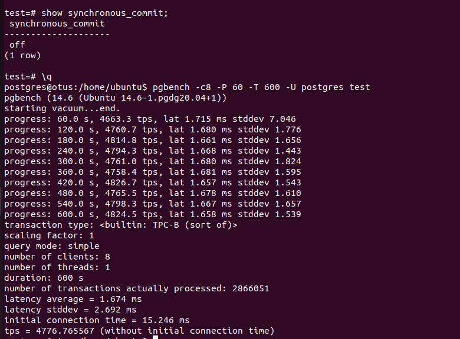

* Настроим время выполнения контрольной точки:

* Зафиксируем себе текузий lsn

.png)

* Подаем нагрузку

* Теперь значение:

* Измеряем объем журнала

* Проверяем статистику

* checkpoints_timed (выполненных по расписанию) выше чем checkpoints_req (по требованию). Но последнее сработало 3 раза, значит были скачки превышения размера wal.

* Теперь тестируем нагрузку в асинхронном режиме.

* tps вырос в разы, в этом и есть плюс данного режима. В этом режиме сервер сообщает об успешном завершении транзакции сразу как та будет завершена логически, прежде чем записи WAL фактически будут записаны на диск. Сброс на диск идет через определенные циклы времени и только когда страница будет заполнена (если таких нет то записывает последнюю).

* Создаем новый кластер с включенной контрольной суммой страниц, заведем таблицу test с парой значений в ней. Если мы просто добавим пару байт (к примеру 01), то ошибок при обращении к таблице не будет, но когда удалим появится ошибка что контрольная сумма не совпадает, можно включить параметр, который игнорирует эту ошибку. Но, как видим, мы повредили данные строки (значение было 100) и теперь они неконсистентны.

